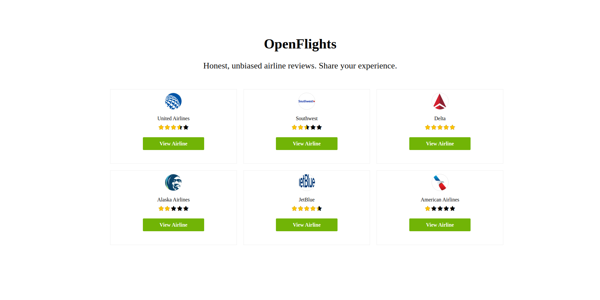

# Open-Flights



> This project follows the tutorial from (https://www.youtube.com/watch?v=oyjzi837wME&t). It uses Rails-React to develop a CRUD app.

## Built With

- Ruby
- Ruby on Rails
- React JS

## Live Demo

[Live Demo](open-flights-alex.netlify.app)

### Usage

In this app you are able to create reviews to any of the six airline companies created.

### Getting Started (For Developers)

```
Open Terminal
run git clone git@github.com:abouhid/open-flights.git
run cd open-flights
run bundle install
run rake db:create
run rake db:migrate
run rails s
```

Open `http://localhost:3000/` in your browser.

### Deployment

This project has been deployed on Heroku using the `Heroku CLI` and a continuous deployment pipeline has been setup between Heroku and GitHub.

## Authors

👤 **Alexandre Bouhid**

- Github: [@abouhid](https://github.com/abouhid)
- LinkedIn: [Alexandre Bouhid](https://www.linkedin.com/in/alexandrebouhid/)

## 🤝 Contributing

Contributions, issues and feature requests are welcome!

## Show your support

Give a ⭐️ if you like this project!

## Acknowledgments

- Microverse
- GitHub
- TheOdinProject
- Ruby on Rails
